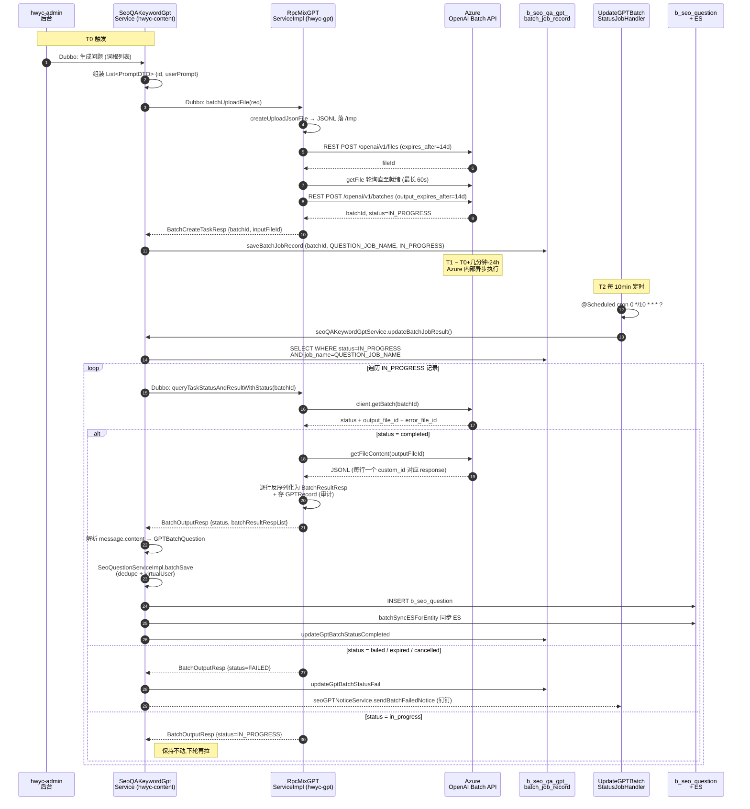
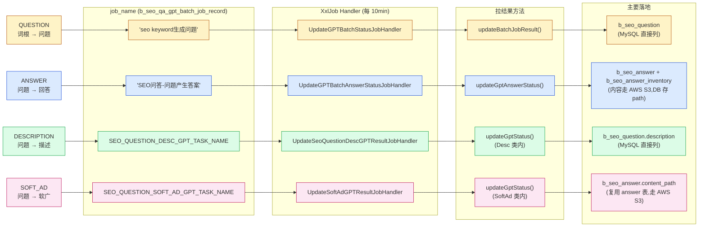

# SEO 问答 GPT 生成链路(hwyc)

> 覆盖:词根 → 问题 → 回答 / 描述 / 软广 四条支线,含触发、上行、Azure Batch、轮询、落地全过程。
>
> 相关模块:hwyc-admin(触发) / hwyc-content(编排) / hwyc-gpt(Azure 对接) / Azure OpenAI Batch API。

---

## 一、总览图(分层架构)

```mermaid
flowchart TB
    %% ========== ① 触发层 ==========
    subgraph Trigger["① 触发层"]
        direction LR
        Admin["hwyc-admin 后台<br/>运营手动触发"]
        JobQ["GPTGenerationToQuestion<br/>JobHandler<br/>(每 2h + XxlJob)"]
        JobA["GenerateAnswer<br/>JobHandler<br/>(每 2h + XxlJob)"]
        JobD["GenerateQuestionDesc<br/>JobHandler<br/>(XxlJob 手动)"]
        JobS["GenerateSoftAd<br/>JobHandler<br/>(每 1min + XxlJob)"]
    end

    %% ========== ② 上行提交层 ==========
    subgraph Upload["② 上行提交层 (hwyc-content)"]
        direction LR
        GenQ["SeoQAKeywordGptService<br/>QUESTION_JOB_NAME<br/>= 'seo keyword生成问题'"]
        GenA["BatchSeoAnswerGenerator<br/>ANSWER_JOB_NAME<br/>= 'SEO问答-问题产生答案'"]
        GenD["BatchSeoQuestionDescGenerator<br/>SEO_QUESTION_DESC_GPT_TASK_NAME"]
        GenS["BatchSeoQuestionSoftAdGenerator<br/>SEO_QUESTION_SOFT_AD_GPT_TASK_NAME"]
    end

    %% ========== ③ GPT 侧 ==========
    subgraph GPTSide["③ hwyc-gpt (Azure Batch 对接)"]
        direction TB
        Rpc["RpcMixGPTServiceImpl<br/>batchUploadFile / queryTaskStatus"]
        AzureSvc["AbstractBatchAzureGPTService<br/>--------<br/>① createUploadJsonFile<br/>&nbsp;&nbsp;→ 拼 JSONL 落本地 /tmp<br/>② uploadFileWithExpiry<br/>&nbsp;&nbsp;→ RestTemplate POST /openai/v1/files<br/>&nbsp;&nbsp;&nbsp;&nbsp;expires_after=14d<br/>③ getFile 轮询就绪<br/>④ createBatchWithOutputExpiry<br/>&nbsp;&nbsp;→ RestTemplate POST /openai/v1/batches<br/>&nbsp;&nbsp;&nbsp;&nbsp;output_expires_after=14d"]
        GPTRecord[("hwyc-gpt.GPTRecord<br/>原始 prompt / result / tokens 审计")]
    end

    Azure[("Azure OpenAI Batch API<br/>completion_window = 24h<br/>output_file_id / error_file_id")]

    %% ========== 状态表 ==========
    Record[("b_seo_qa_gpt_batch_job_record<br/>--------<br/>batch_id | job_name | status<br/>input_file_id | gpt_model | extend")]

    %% ========== ④ 轮询层 ==========
    subgraph Poll["④ 下行轮询层 (每 10min @Scheduled + XxlJob)"]
        direction LR
        PollQ["UpdateGPTBatchStatusJobHandler<br/>→ updateBatchJobResult()"]
        PollA["UpdateGPTBatchAnswerStatusJobHandler<br/>→ updateGptAnswerStatus()"]
        PollD["UpdateSeoQuestionDescGPTResultJobHandler<br/>→ updateGptStatus()"]
        PollS["UpdateSoftAdGPTResultJobHandler<br/>→ updateGptStatus()"]
    end

    %% ========== ⑤ 解析落地 ==========
    subgraph Parse["⑤ 解析 & 落地 (按 job_name 分四路)"]
        direction TB
        ParseQ["QUESTION 支线<br/>GPTBatchQuestion.questions[]<br/>→ SeoQuestionServiceImpl.batchSave<br/>&nbsp;&nbsp;• dedupe by formatQuestion<br/>&nbsp;&nbsp;• 挂 virtualUser<br/>&nbsp;&nbsp;• INSERT b_seo_question"]
        ParseA["ANSWER 支线<br/>GPTBatchAnswer.answers[]<br/>→ 分桶:display (2-6) / inventory (其余)<br/>display: buildVo 三份内容上传 AWS<br/>&nbsp;&nbsp;content→contentPath<br/>&nbsp;&nbsp;gptAnswer→gptAnswerPath<br/>&nbsp;&nbsp;byPass→byPassAnswerPath<br/>&nbsp;&nbsp;UPSERT b_seo_answer<br/>inventory: uploadFileToAws<br/>&nbsp;&nbsp;INSERT b_seo_answer_inventory"]
        ParseD["DESCRIPTION 支线<br/>description 字符串<br/>→ b_seo_question.description<br/>&nbsp;&nbsp;+ descGptExecuteStatus=SUCCESS<br/>&nbsp;&nbsp;+ descCtime=now<br/>→ UPDATE b_seo_question"]
        ParseS["SOFT_AD 支线<br/>softAd 字符串 → vo.content<br/>→ iSeoAnswerService.batchSaveOrUpdate<br/>&nbsp;&nbsp;(内容走 AWS,复用 b_seo_answer)<br/>+ question.softAdGptExecuteStatus=SUCCESS"]
    end

    %% ========== 存储矩阵 ==========
    subgraph Storage["⑥ 存储矩阵"]
        direction LR
        MySQL[("MySQL<br/>--------<br/>b_seo_qa_gpt_batch_job_record<br/>b_seo_question<br/>b_seo_answer (path 字段)<br/>b_seo_answer_inventory (path 字段)")]
        ES[("Elasticsearch<br/>--------<br/>es_seo_qa_question_*<br/>es_seo_qa_answer_*<br/>(落地页 / 搜索快速召回)")]
        S3[("AWS S3<br/>--------<br/>contentPath / gptAnswerPath<br/>/ byPassAnswerPath<br/>文件名 = MD5(now + rand10)")]
    end

    %% ========== 连接 ==========
    Admin --> GenQ & GenA & GenD & GenS
    JobQ --> GenQ
    JobA --> GenA
    JobD --> GenD
    JobS --> GenS

    GenQ & GenA & GenD & GenS -- "Dubbo<br/>rpcMixGPTService.batchUploadFile" --> Rpc
    GenQ & GenA & GenD & GenS -. "saveBatchJobRecord<br/>batchId + jobName + IN_PROGRESS" .-> Record

    Rpc --> AzureSvc
    AzureSvc -- "REST /openai/v1/files<br/>REST /openai/v1/batches" --> Azure
    AzureSvc -. "落 GPTRecord" .-> GPTRecord

    Record -- "WHERE status=IN_PROGRESS<br/>AND job_name=?" --> PollQ & PollA & PollD & PollS

    PollQ & PollA & PollD & PollS -- "queryBatchOutputResp<br/>Dubbo queryTaskStatusAndResultWithStatus" --> Rpc
    Azure -. "output_file / error_file" .-> AzureSvc

    PollQ --> ParseQ
    PollA --> ParseA
    PollD --> ParseD
    PollS --> ParseS

    ParseQ --> MySQL
    ParseA --> MySQL
    ParseA -- "三份文本上传" --> S3
    ParseD --> MySQL
    ParseS --> MySQL
    ParseS -- "软广文本上传" --> S3

    MySQL -. "iEsSeoQAProcesService<br/>batchSyncESForEntity" .-> ES

    %% ========== 状态推进 ==========
    ParseQ & ParseA & ParseD & ParseS -. "updateGptBatchStatusCompleted / Fail<br/>+ 钉钉告警(失败时)" .-> Record

    %% ========== 样式 ==========
    classDef trigger fill:#FFF4E6,stroke:#F59E0B,color:#7C2D12
    classDef upload  fill:#E0F2FE,stroke:#0284C7,color:#0C4A6E
    classDef gpt     fill:#F3E8FF,stroke:#7C3AED,color:#4C1D95
    classDef poll    fill:#DCFCE7,stroke:#16A34A,color:#14532D
    classDef parse   fill:#FEE2E2,stroke:#DC2626,color:#7F1D1D
    classDef store   fill:#F1F5F9,stroke:#475569,color:#0F172A,font-weight:bold
    classDef ext     fill:#FEF3C7,stroke:#B45309,color:#7C2D12

    class Admin,JobQ,JobA,JobD,JobS trigger
    class GenQ,GenA,GenD,GenS upload
    class Rpc,AzureSvc,GPTRecord gpt
    class Azure ext
    class Record store
    class PollQ,PollA,PollD,PollS poll
    class ParseQ,ParseA,ParseD,ParseS parse
    class MySQL,ES,S3 store
```



---

## 二、时序图(单次"问题生成"完整生命周期)



---

## 三、四条支线对比



---

## 四、关键设计点摘要

| 设计点 | 具体做法 | 目的 |
|---|---|---|
| 采用 Batch API 而非同步 chat | 拼 JSONL → Files → Batches,`completion_window=24h` | 成本低、量大、异步可容忍延迟 |
| 绕过 Azure Java SDK | `RestTemplate` 直接调 `/openai/v1/files` / `/openai/v1/batches` | SDK 不序列化 `expires_after` / `output_expires_after`,会踩 Azure 文件配额上限 |
| `b_seo_qa_gpt_batch_job_record` | 存 batchId + job_name + status(+ extend 存错误) | 支持断点续拉、失败重试、状态审计 |
| 一表多用,靠 `job_name` 分区 | 四个 XxlJob 各自 `WHERE job_name=?` 过滤 | 失败隔离、锁隔离、环境白名单可差异化 |
| GPT 原文单独审计 | hwyc-gpt 端存 `GPTRecord`(prompt / result / tokens) | 复盘、成本核算 |
| 短文本 vs 长文本分离 | 问题 / 描述 → MySQL 列;回答 / 软广 → S3 + path | 省 MySQL 存储,便于 CDN 分发 |
| 三份回答内容并存 | `contentPath`(展示清洗)、`gptAnswerPath`(原意)、`byPassAnswerPath`(反 AI 检测) | 场景化下发 + 复盘 + 反检测 |
| ES 二级索引 | `iEsSeoQAProcesService.batchSyncESForEntity` | 落地页 / 搜索快速召回 |
| Guava `RateLimiter` | 重试 `create(0.05D)` / 查询 `create(1D)` | 保护 Azure 配额、防 429 |
| 虚拟用户 | `virtualUserQueryService.next(language)` | 给 AI 生成的问答挂拟人化元数据 |

---

## 五、如何查看这张图

- **VSCode**:装 `Markdown Preview Mermaid Support` 后直接打开预览
- **IntelliJ IDEA**:装 `Mermaid` 插件,`.md` 文件里预览
- **GitHub / GitLab**:提到远端,`.md` 中的 mermaid 代码块自动渲染
- **导出静态图**:
  ```bash
  npx @mermaid-js/mermaid-cli -i seo-qa-pipeline.md -o pipeline.png
  ```
- **在线预览 / 编辑**:粘贴到 <https://mermaid.live>
